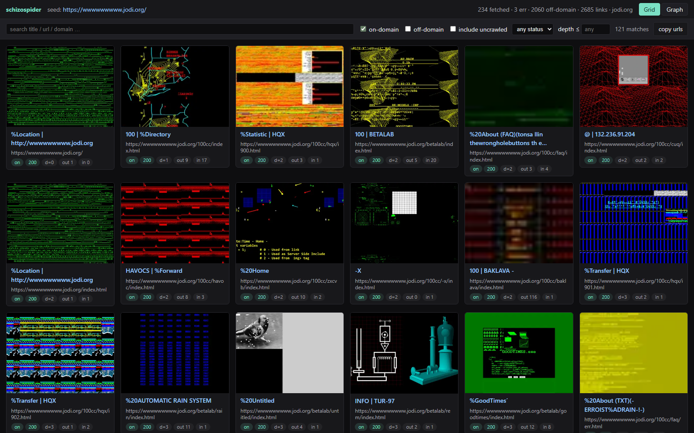
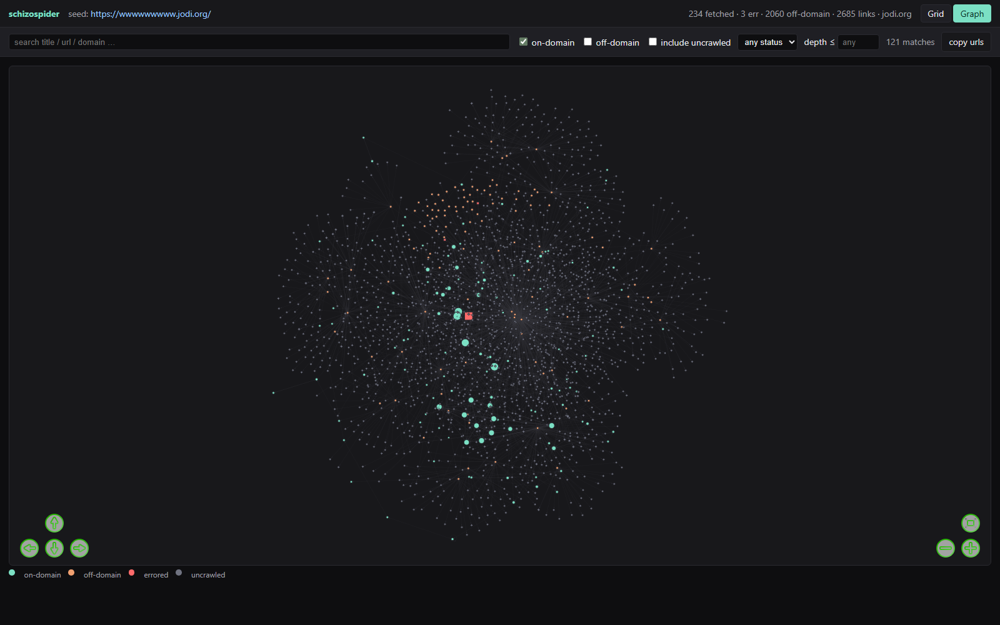
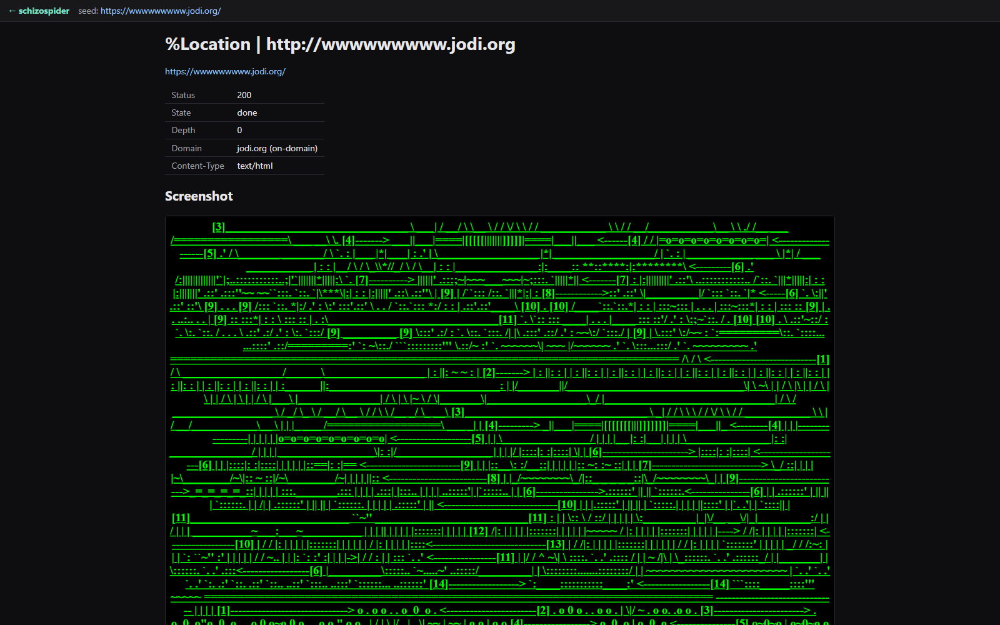

# schizospider

[](https://github.com/coldcraft/schizospider/actions/workflows/test.yml)
[](https://www.python.org/downloads/)
[](LICENSE)

> Interactive crawler for weird/artsy websites. Spiders every page on the seed domain, follows off-domain links exactly one hop, screenshots every URL, and produces a self-contained HTML report with a screenshot grid, force-directed link graph, per-page detail views, and search/filter.

Built for exploring sites like [wwwwwwwww.jodi.org](https://wwwwwwwww.jodi.org/) — frameset-heavy, JavaScript-laden, intentionally-broken net.art. Polite enough for ordinary sites too.



## What it does

- **Full-page screenshots** of every URL it reaches (PNG, captured by headless Chromium via Playwright).
- **Captures the raw DOM** of each page so you can pop it open after the fact.
- **Spiders the whole seed site**, with **registrable-domain** matching so `wwwwwwwww.jodi.org` and `oss.jodi.org` are treated as one site.
- **Follows off-domain links one hop** — if jodi links to cnn.com, you get cnn.com's homepage but not the rest of CNN.
- **Live TUI** (Textual) shows the queue growing, per-worker activity, p50/p95 fetch times, and lets you click into any captured page mid-crawl.
- **HTML report** is a single folder you can zip and share. Open `report.html` in any browser.
- **Resumable**. Re-invoke with the same `--run-id` after a crash or `Ctrl-C` and it picks up where it stopped.
- **Reasonable against hostile pages**: dismisses JavaScript dialogs, closes popups, blocks media files, caps every page at 90 seconds, retries on transient failures, walks every frame in framesets.

## Install

```bash
pip install -e .
playwright install chromium
```

Python 3.11+. Developed on Windows 11; Linux and macOS should work (Playwright supports them) but aren't routinely tested.

## Quick start

```bash
# Default: live TUI, watch it crawl in real time
schizospider --seed https://wwwwwwwww.jodi.org/

# Bounded run — handy for trying a new site
schizospider --seed https://sitcomtheory.org/ --max-pages 200

# Headless run with rolling log
schizospider --seed https://example.com/ --no-tui

# Resume a previous run after Ctrl-C or a crash
schizospider --seed https://example.com/ --run-id my-run

# Rebuild only the HTML report from an existing run's database
schizospider --report-only my-run
```

Output goes to `out/<run-id>/`. Open `out/<run-id>/report.html` in a browser when you're done — no dev server required.

## The HTML report

Grid view (thumbnails, searchable, filterable by domain / status / depth):


Graph view (force-directed; on-domain mint, off-domain orange, errored red, uncrawled grey):



Per-page detail (screenshot, captured DOM via sandboxed iframe, inbound/outbound links, headers):



## TUI keybindings

| key | action |
|-----|--------|
| `q` | quit (drains the queue cleanly, builds the report) |
| `r` | build/refresh the HTML report mid-crawl |
| `p` | pause / resume crawling |
| `/` | open the filter input |
| `↑` `↓` | navigate the URL list; selection drives the detail panel |
| `esc` | cancel filter input |

## CLI flags

| flag | default | description |
|------|---------|-------------|
| `--seed URL` | (required) | seed URL to start from |
| `--run-id NAME` | auto | run identifier; output goes to `out/<run-id>/` |
| `--out DIR` | `out` | output root directory |
| `--concurrency N` | `4` | concurrent workers (each is its own browser context) |
| `--politeness-ms MS` | `250` | minimum gap between starts to the same host |
| `--max-pages N` | `0` (unlimited) | stop after N pages have completed |
| `--strict-host` / `--include-subdomains` | include subdomains | on-domain matching mode |
| `--respect-robots` / `--ignore-robots` | ignore | honor robots.txt? |
| `--block-media` / `--no-block-media` | block | drop mp4 / webm / mov / mp3 etc. for speed |
| `--no-tui` | off | headless, prints log lines to stdout |
| `--headed` | off | show the Chromium window (debugging) |
| `--report-only ID` | — | skip crawling, just (re)build the report |
| `-v` / `--verbose` | off | DEBUG-level logging |

## Architecture

```
src/schizospider/
  cli.py            click entrypoint, builds Settings, launches loop
  config.py         immutable Settings + run-dir resolver
  urls.py           canonicalize, classify, same-site (tldextract); javascript:href extraction
  store.py          SQLite DAO with WAL; lease / complete / fail; auto-resume
  fetcher.py        Playwright wrapper; dialog/popup handlers; per-step timeouts
  extractor.py      frame-tree walker; a/area/frame/iframe + inline-script URL harvest
  crawler.py        async worker pool; per-host pacing; 90s hard ceiling; p50/p95 stats
  events.py         pub-sub bus crawler→TUI
  tui/app.py        Textual app: counters, worker bar, URL list, detail panel, log
  report/build.py   reads SQLite → renders Jinja2 templates + writes data.js + thumbnails
  report/templates/ HTML / CSS / JS (vanilla, no build step) + bundled vis-network
```

State lives in `out/<run-id>/db.sqlite` (WAL mode). Workers `lease_next()` atomically; on startup any `in_flight` rows from a previous crash are requeued automatically.

## Anti-jodi defenses

Crawling jodi.org and similar art sites surfaced a lot of edge cases. Current defenses:

| failure mode | defense |
|--------------|---------|
| `alert/confirm/prompt` popups | context-level `dialog.dismiss()` |
| `window.open()` popups | per-page `popup` listener that closes the spawned page |
| navigation never settles | `wait_until="domcontentloaded"` + lenient `networkidle` follow-up |
| page hangs past per-step timeouts | outer 90 s hard ceiling on the whole fetch |
| infinite redirects | Playwright caps; we also limit `redirected_from` chain |
| huge pages | full-page screenshot clipped, captured HTML capped at 5 MB |
| binary masquerading as HTML | content-type check before screenshotting |
| encoding garbage | `chardet` fallback when `<meta charset>` is missing or lies |
| `javascript:` hrefs | regex-extract embedded URLs from `window.open` / `location.href` patterns; never execute |
| mixed-content / bad certs | `ignore_https_errors=True` |
| inline video hanging the page | media file routes aborted by default (`--no-block-media` to disable) |
| hostile JS in captured DOM | iframe view uses a strict CSP (`script-src 'none'`); a separate `pages_safe/` copy with `<base href>` so framesets render without running scripts |

## Safety note on captured HTML

The crawler stores **two views** of each captured page:

- `pages/<sha>.html` — the **raw** captured DOM, untouched. Opening this file directly will let the page's JavaScript run unrestricted (whatever the original site shipped — possibly hostile, possibly trying to navigate or redirect). The detail page exposes this as a red **"raw capture ⚠"** button.
- `pages_safe/<sha>.html` — the **sandboxed** copy with `Content-Security-Policy: script-src 'none'` and a `<base href>` so relative URLs in framesets / images resolve against the original site (which loads over the network if you're online). This is what the iframe button and the "open sandboxed copy in new tab" button use.

Default to the sandboxed copy unless you really want to see the original behavior.

## Development

```bash
pip install -e ".[dev]"
pytest        # 18 unit tests covering urls, extractor, store
ruff check .
```

## License

MIT. See [LICENSE](LICENSE).
